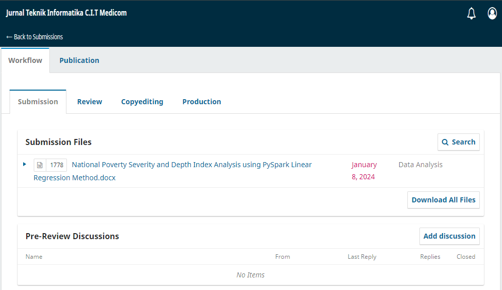
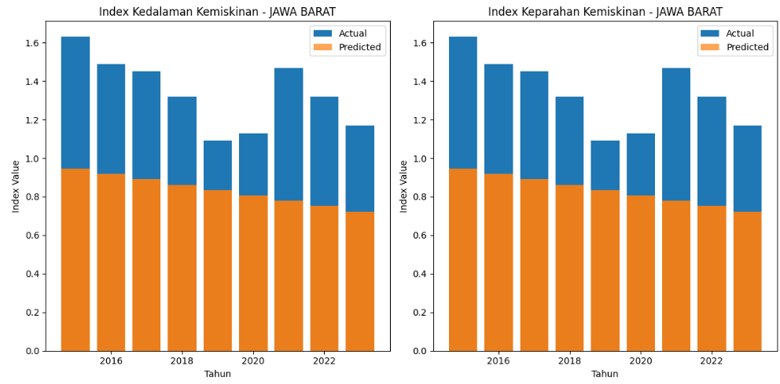
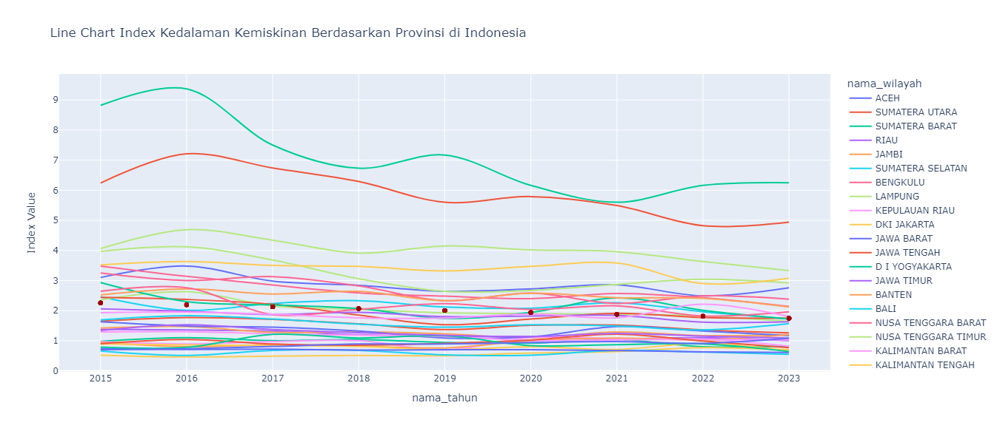
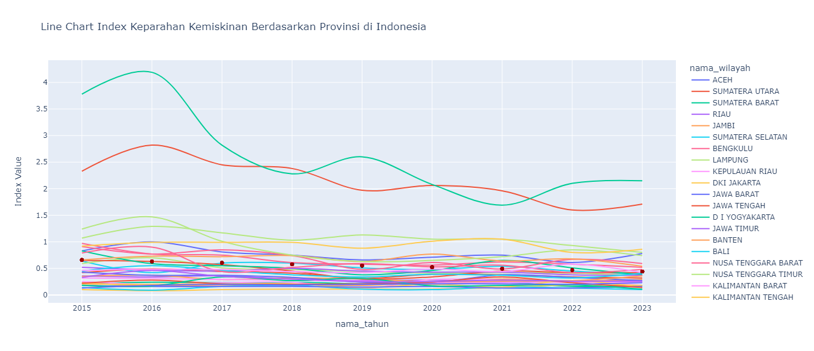
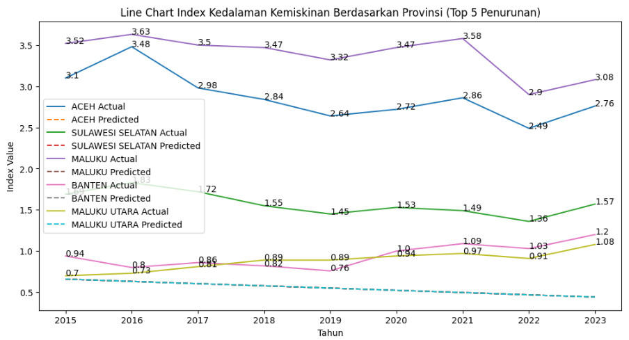
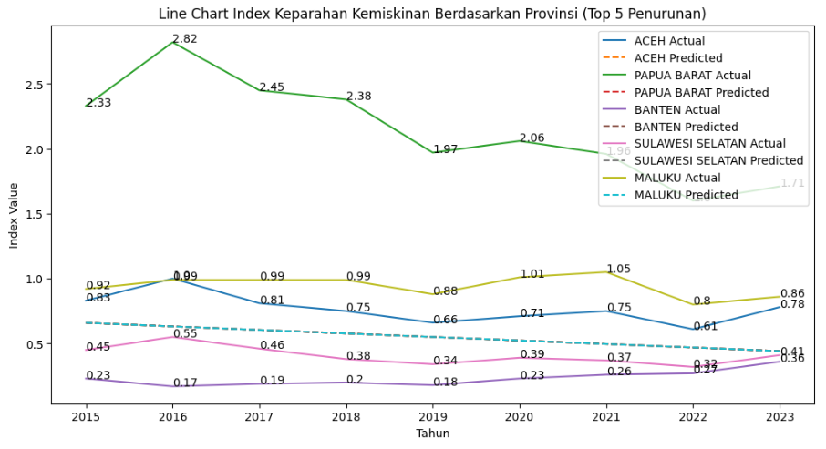
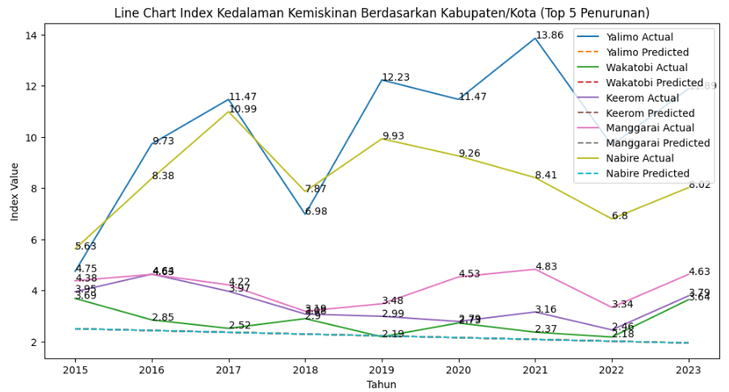
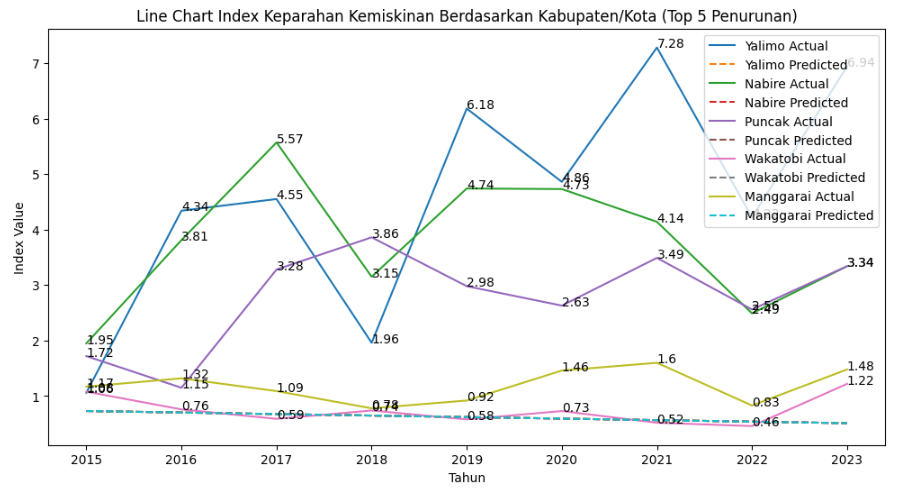

# *National Poverty Severity and Depth Index Analysis using PySpark Linear Regression Method*

# Analisis Indeks Kedalaman dan Keparahan Kemiskinan Nasional Menggunakan Metode Regresi Linear PySpark

## Penulis
**Febro Herdyanto**
- Teknik Informatika, Universitas Pelita Bangsa, Jawa Barat, Indonesia

## Publikasi
- Informasi publikasi jurnal penelitian ini sedang dalam tahap tinjauan editor
> Publisher :  
> Institute of Computer Science (IOCS)  
> **Jurnal Teknik Informatika C.I.T Medicom**  
> Kunjungi [https://medikom.iocspublisher.org/index.php/JTI](https://medikom.iocspublisher.org/index.php/JTI) untuk informasi lebih lanjut.

## Ringkasan
Penelitian ini menghadirkan analisis mendalam mengenai indeks kemiskinan di Indonesia dengan menggunakan PySpark untuk analisis regional dan sub-regional yang komprehensif. Tujuan utama adalah mengungkap pola dan determinan yang memengaruhi kemiskinan, memberikan wawasan berbasis bukti untuk intervensi kebijakan yang tepat sasaran. Langkah awal melibatkan preprocessing data yang cermat, termasuk penanganan nilai yang hilang dan penyesuaian kolom untuk memastikan kualitas data. Fase eksplorasi berfokus pada Jawa Barat, di mana prediksi divisualisasikan melalui grafik batang untuk "Indeks Kedalaman Kemiskinan" dan "Indeks Keparahan Kemiskinan." Analisis kemudian diperluas ke tingkat sub-regional (kabupaten/kota), di mana model regresi linear berbeda dilatih dan divisualisasikan menggunakan grafik garis. Penekanannya adalah menyoroti lima wilayah teratas yang menunjukkan penurunan signifikan dalam indeks kemiskinan. Temuan penelitian memberikan wawasan berharga tentang variasi kemiskinan regional dan sub-regional, mendukung pengambilan keputusan berbasis bukti untuk strategi pengentasan kemiskinan yang efektif di Indonesia. Dengan memanfaatkan teknik pembelajaran mesin, penelitian ini menunjukkan potensi model prediktif untuk memberikan wawasan yang dapat diimplementasikan, memperkaya diskursus terus-menerus tentang pengentasan kemiskinan, dan memberikan dasar yang kuat untuk pembuatan kebijakan berbasis bukti.

## Isi
1. **Pendahuluan**
   - Konteks permasalahan kemiskinan di Indonesia.
   - Faktor-faktor kontributor, termasuk pertumbuhan ekonomi tidak merata, rendahnya tingkat pendidikan, disparitas regional, dan efektivitas kebijakan publik.

2. **Metode Penelitian**
   - Penjelasan metode penelitian yang terstruktur.
   - Penggunaan PySpark dan Regresi Linear untuk menganalisis hubungan antara pertumbuhan ekonomi, tingkat pendidikan, disparitas regional, kebijakan publik, dan tingkat kemiskinan.

3. **Hasil dan Pembahasan**
   - Tahapan analisis data, preprocessing, dan eksplorasi.
   - Analisis regional, sub-regional, dan kabupaten/kota.
   - Evaluasi model dengan metrik seperti RMSE dan R-squared.
   - Visualisasi prediksi untuk indeks kedalaman dan keparahan kemiskinan.
   - Fokus pada lima wilayah teratas dengan penurunan signifikan.

4. **Kesimpulan**
   - Temuan kunci dan implikasi.
   - Kontribusi terhadap pemahaman mengenai kemiskinan di Indonesia.
   - Pentingnya kebijakan yang disesuaikan dengan nuansa regional.

## Cara Menggunakan
1. **Prasyarat**
   - Instalasi PySpark dan dependensinya.
   - Memiliki dataset Badan Pusat Statistik (BPS) Indonesia tahun 2015-2023.

2. **Eksekusi Kode**
   - Pastikan dataset telah dimuat dan di-preprocess.
   - Jalankan langkah-langkah analisis sesuai urutan dalam kode.

3. **Interpretasi Hasil**
   - Evaluasi hasil model menggunakan RMSE dan R-squared.
   - Interpretasikan visualisasi untuk mendapatkan wawasan mendalam.

4. **Replikasi Analisis**
   - Petunjuk untuk mereplikasi atau memodifikasi analisis pada wilayah atau tingkatan lain.

## Hasil dan Pembahasan
1. **Data Preprocessing dan Exploration**
   - Langkah awal melibatkan preprocessing data menggunakan PySpark.
   - Pemrosesan dataset, penanganan nilai yang hilang, dan penyesuaian tipe data untuk memastikan kualitas data.
   - Visualisasi skema dataset, jumlah nilai null/NaN, dan konversi tipe data.

2. **Analisis Regional - Jawa Barat**
   - Pemfilteran dataset untuk fokus pada "JAWA BARAT."
   - Penggunaan Vector Assembler dan pelatihan model Regresi Linear untuk memprediksi nilai indeks kedalaman dan keparahan kemiskinan.
   - Visualisasi prediksi menggunakan grafik batang untuk kedua indeks.
   

3. **Evaluasi Model**
   - Pengukuran kinerja model menggunakan Root Mean Squared Error (RMSE) dan R-squared (R2).
   - Evaluasi menunjukkan seberapa baik model mampu memprediksi nilai indeks kemiskinan.
    > Root Mean Squared Error (RMSE): 0.5183885953853059  
    > R-squared (R2): 0.01885649059581518

4. **Visualisasi Hasil - Analisis Regional**
   - Visualisasi prediksi menggunakan grafik batang untuk indeks kedalaman dan keparahan kemiskinan di tingkat provinsi.
   - Fokus pada lima wilayah teratas dengan penurunan signifikan.

   **Line Chart Index Kedalaman Kemiskinan Berdasarkan Provinsi di Indonesia**
   

   **Line Chart Index Keparahan Kemiskinan Berdasarkan Provinsi di Indonesia**
   

5. **Analisis Sub-Regional - Kabupaten/Kota**
   - Penerapan model Regresi Linear pada tingkat sub-regional (kabupaten/kota).
   - Visualisasi hasil dengan grafik garis untuk indeks kedalaman dan keparahan kemiskinan.

6. **Top 5 Regions with Significant Reduction**
   - Analisis tambahan menyoroti lima wilayah dengan penurunan signifikan dalam indeks kemiskinan.
   - Visualisasi dengan grafik garis untuk kedalaman dan keparahan kemiskinan.

   **Line Chart Index Kedalaman Kemiskinan Berdasarkan Provinsi (Top 5 Penurunan)**
   
   
   **Line Chart Index Keparahan Kemiskinan Berdasarkan Provinsi (Top 5 Penurunan)**
   
   
   **Line Chart Index Kedalaman Kemiskinan Berdasarkan Kabupaten/Kota (Top 5 Penurunan)**
   
   
   **Line Chart Index Keparahan Kemiskinan Berdasarkan Kabupaten/Kota (Top 5 Penurunan)**
   

7. **Insights and Implications**
   - Temuan penelitian memberikan wawasan mendalam tentang faktor-faktor yang memengaruhi indeks kemiskinan.
   - Variasi regional dan sub-regional memberikan pemahaman nuansa pada lanskap kemiskinan.
   - Model prediktif memberikan wawasan berbasis tindakan untuk intervensi kebijakan.

8. **Kesimpulan**
   - Analisis mengidentifikasi pertumbuhan ekonomi tidak merata, peran pendidikan dalam kesempatan kerja, dan ketidaksetaraan regional sebagai faktor kunci.
   - Model prediktif, terutama di tingkat regional dan sub-regional, memberikan wawasan yang dapat diimplementasikan untuk pembuat kebijakan.
   - Evaluasi model menunjukkan keandalan pendekatan Regresi Linear.
   - Visualisasi memperkaya interpretasi hasil dan menyoroti wilayah dengan penurunan signifikan dalam kemiskinan.
   - Penelitian ini memberikan sumbangan pada pembahasan pengentasan kemiskinan di Indonesia dan memberikan dasar berbasis bukti untuk pengambilan keputusan.

## Kontribusi
- Kontribusi atau saran tambahan untuk pengembangan analisis.
- Pelaporan bug atau masalah pada kode.

## Referensi
- Daftar referensi atau sumber data yang digunakan dalam penelitian. (Liat file document pada jurnal)

## Kontak
- Informasi kontak penulis untuk pertanyaan atau kolaborasi.
> Email : febroherdyanto@mhs.pelitabangsa.ac.id

